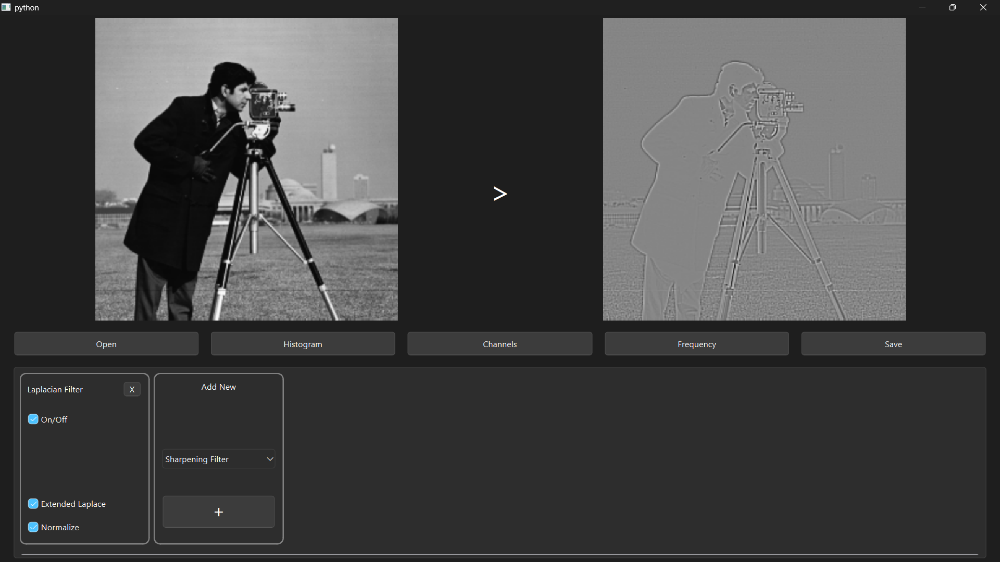

# impros

This project is a PySide6-based graphical user interface (GUI) application that provides an interactive platform for image processing. It supports the implementation of custom methods, from basic operations to advanced image processing algorithms. Users can apply various transformations to input images and observe the results in real time. The application can serve both as a ready-to-use tool and as a flexible framework for custom development and experimentation.



---
## How to Install

### Option 1: Download the Executable
1. Go to the Releases page.
2. Download the appropriate release for your operating system.
3. Run the executable — no installation or setup required.

### Option 2: Run from Source

1. Make sure you have Python 3.7+ installed.  
2. Clone this repository:  
```
git clone https://github.com/ouzdu-s/gui-based-image-processing-with-opencv.git
```
3. Navigate to the project directory:  
```
cd gui-based-image-processing-with-opencv
```
4. Install required packages:  
```
pip install -r requirements.txt
```
5. Run the main Python script `main.py` to launch the GUI:  
```
python main.py
```

---
## How to Use

1. Launch the application. 
2. Use the GUI buttons to load an image.  
3. Select desired image processing methods from the bottom menu.  
4. Observe the processed image in real-time.  
5. Export the resulting images as needed.

---
## Code Structure

* The application is organized around six main classes, each with a specific role:

* `MainWindow`: Initializes the GUI and manages the main layout of the application.

* `UIManagement`: Handles user interactions such as drag-and-drop, switching between multiple views (e.g., histogram or color layers), file selection etc.

* `Pipeline`: Manages operations like adding, removing, reordering, and executing toolboxes in the order they are applied.

* `Toolboxes`: Each image processing method is represented as an independent toolbox (e.g., BrightnessBox, ContrastBox). These toolboxes are the core interactive modules that users can add to the processing pipeline.

* To avoid repetitive code and speed up toolbox development, all toolboxes inherit from two base classes:

* `UIComponents`: Provides reusable GUI elements like buttons, sliders, and input fields.

* `Processor`: Contains the actual image processing functions, built using OpenCV.

---
## How to Add Your Own Image Processing Methods

This project is built to be modular and easy to extend. To add a new image processing method, follow these steps:

1. **Update the `TOOLBOXES` list in `constants.py`:**  
    Add a new dictionary entry with a display name and class name. Use the following structure:

    ```python
    "YOUR_METHOD": { 
        "NAME": "Your Method Name", 
        "CLASS": "YourMethodBox" 
    }
    ```

2. **Create a new class in `toolboxes.py`:**
    Define a class that inherits from DraggableToolbox. Use the same class name you provided in the `TOOLBOXES` list. Use the following structure:

    ```python
    class YourMethodBox(DraggableToolbox):
        def __init__(self):
            super().__init__(constants.TOOLBOXES['YOUR_METHOD']['NAME'])

            # Insert your UI components here, for example:
            # self.brightness_slider = self.insert_slider(heading="Brightness", minValue=-100, maxValue=100)

        def execute(self, imageBGRA, mask):
            # Apply your image processing logic here, For example:
            # imageBGRA = self.adjust_brightness(imageBGRA, self.brightness_slider[0].value(), mask)

            return imageBGRA
    ```

3. **Use predefined UI components:**  
   You can directly use predefined UI components (e.g., sliders, switches, buttons) via `self.` in your toolbox class.  
   To see the available options, check the `ui_components.py` file.

4. **Use predefined image processing methods:**  
   You can directly use predefined image processing functions.  
   To explore them, check the `processor.py` file and call the methods via `self.`.

5. **Create your own UI components:**
    You can Also create your custom UI components.
    To ensure proper state management (e.g., auto-update when a value changes), define your custom UI components **as methods inside the `UiComponents` class in `ui_components.py`**, rather than directly in the toolbox class. Use the following method structure:

    ```python
    def your_ui_component(self, parent=None):

        # Keep this line unchanged to ensure the component is added to the correct parent widget.
        parent = self.parent_widget if parent is None else parent

        # Create your UI component here, for example:
        component = QCheckBox("heading")

        # Make sure you have the following two lines for component to work correctly:
        component.stateChanged.connect(self.on_change)
        parent.addWidget(component)

        return component
    ```

6. **Create your own processing methods:**
    If you need to implement custom image processing logic, define them **as methods inside the `Processors` class in `processors.py`** to 
    be able to use the helper methods and keep the code organized. You can use the following method structure:

    ```python
    def your_method(self, imageBGRA):

        # implement your image processing logic here, for example:

        # imageHSVA = self.bgra2hsva_transform(imageBGRA)                           
        # brightened = cv2.add(imageHSVA[:, :, 2], value)                 
        # imageBGRA = self.hsva2bgra_transform(imageHSVA)                          

        return imageBGRA
    ```

---
## Contributing
Contributions are welcome! Please open an issue or submit a pull request for any enhancements or bug fixes.


