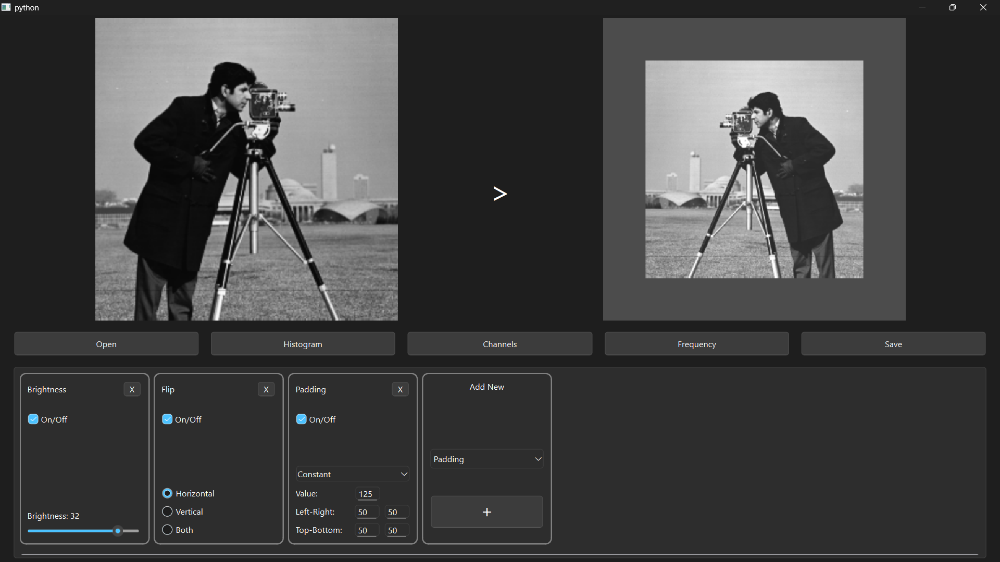

# GUI-Based Image Processing with OpenCV

This project is a PySide6-based graphical user interface (GUI) application built on OpenCV that provides an interactive platform for image processing. It currently includes common techniques such as histogram equalization, filtering, and thresholding, but is designed with a modular architecture to allow easy addition of new image processing methods. Users can apply various operations on input images and observe the results in real time, making it both a practical tool and a flexible framework for experimentation and extension.

## How to Install

1. Make sure you have Python 3.7+ installed.  
2. Clone this repository:  
git clone https://github.com/ouzdu-s/gui-based-image-processing-with-opencv.git

3. Navigate to the project directory:  
cd gui-based-image-processing-with-opencv
4. Install required packages:  
pip install -r requirements.txt

## How to Run

Run the main Python script to launch the GUI:  
python main.py

## How to Use

1. Open the application by running `main.py`.  
2. Use the GUI buttons to load an image.  
3. Select desired image processing methods from the menu.  
4. Observe the processed image in real-time.  
5. Save or export the resulting images as needed.

## How to Add New Image Processing Methods

This project is designed to be modular and easily extensible. To add a new image processing method, follow these steps:

1. add the new method name to the `constants.py` METHOD_NAME = "Method name to display" and add the METHOD_NAME to the TOOLBOX_NAMES list.
2. create a new class in the `toolboxes.py` file that inherits from `DraggableToolbox` and insert the gui elements in the `__init__` method.
3. a number of gui elements are already created in the `components.py` file,  and more can be added as needed. They can be used directly in the new toolbox class.
4. decide what will happen when the toolbox is activated in the 'exectue' method. and return the processed image.
5. a number of image processing methods are already implemented in the 'processor.py' file, and more can be added as needed. They can be used directly in the new toolbox class.
6. lastly you need to add the new toolbox to the `ui_management.py` file as 
4. implement the new method in the `processing_methods.py` file, and add it to the `process_image` function in the same file.

1. **Create a new Python function** implementing your image processing algorithm. Place it in the appropriate module/file (e.g., `processing_methods.py`).  
2. **Define the function to accept an image as input** (usually a NumPy array) and return the processed image.  
3. **Register the new function in the GUI:**  
   - Add it to the list of available image processing options (e.g., menu or buttons).  
   - Connect the GUI control to call your new function when selected.  
4. **Test your new method** by running the application and applying it on sample images.

